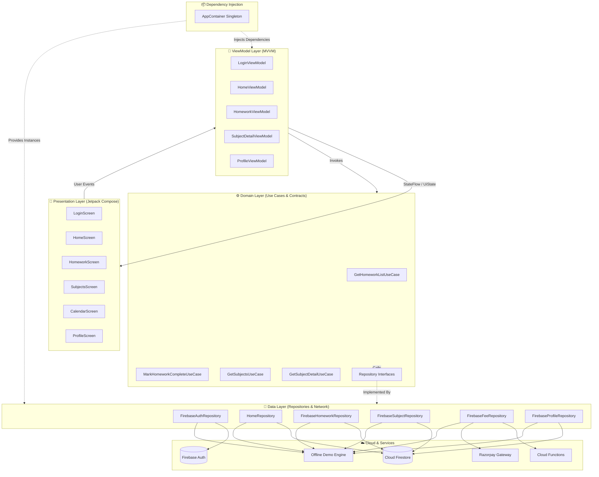
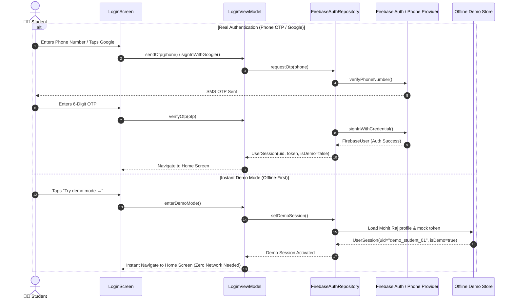
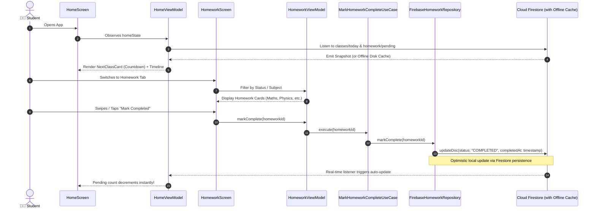

<div align="center">


# MyTuition
### Your offline tuition coaching companion

[](https://github.com/mohitraj8503/MyTuition/releases/latest)
[](https://android.com)
[](https://kotlinlang.org)
[](https://developer.android.com/jetpack/compose)
[](https://firebase.google.com)
[](LICENSE)

**A beautiful, production-ready Android app for offline coaching/tuition centres.**  
Students track daily schedules, homework, attendance, and fees — all in one place.

[📲 Download APK](https://github.com/mohitraj8503/MyTuition/releases/latest) · [🐛 Report Bug](https://github.com/mohitraj8503/MyTuition/issues) · [✨ Request Feature](https://github.com/mohitraj8503/MyTuition/issues)

</div>

---

## 📸 Screenshots

> **Demo mode available** — tap "Try demo mode →" on login to explore without signing up.

| Login | Home | Homework | Schedule |
|-------|------|----------|----------|
| Claymorphic OTP login | Next class + timeline | Subject-wise homework | Weekly date chips |

---

## ✨ Features

### 🏫 For Students
- **📅 Daily Schedule** — See today's classes with subject, teacher, time & room number
- **⏰ Next Class Card** — Countdown to your upcoming class (e.g. "Room 4B, Today 5:00 PM")
- **📝 Homework Tracker** — Subject-wise pending homework with swipe-to-complete
- **✅ Attendance** — Live attendance percentage with class-by-class history
- **💰 Fee Status** — Monthly fee status (Paid / Pending / Overdue) + Razorpay payment
- **📢 Announcements** — Institute-wide notices and updates
- **🎮 Demo Mode** — Explore the full app without signing in

### 🔥 Tech Highlights
- **Claymorphic UI** — Soft clay design system with bouncy spring animations
- **Real-time Data** — Firestore real-time listeners for live schedule updates  
- **Offline-first** — Firestore offline persistence — works without internet
- **Firebase Auth** — Phone OTP + Google Sign-In
- **Cloud Functions** — Razorpay payment integration via Firebase Functions (asia-south1)
- **Clean Architecture** — MVVM + Repository pattern + Use Cases + DI container
- **High Refresh Rate & 60/90/120Hz** — Hardware-accelerated animations with `Modifier.graphicsLayer` and pre-rendered canvas gradient caches

---

## 🏗️ System Architecture & Data Flow

MyTuition strictly follows **Google's Recommended Modern Android Architecture (Clean Architecture + MVVM + Unidirectional Data Flow)**.

```
┌──────────────────────────────────────────────────────────────────┐
│                   PRESENTATION LAYER                             │
│  Jetpack Compose Screens  ──(StateFlow / Events)──► ViewModels   │
└─────────────────────────────────┬────────────────────────────────┘
                                  │
                                  ▼
┌──────────────────────────────────────────────────────────────────┐
│                      DOMAIN LAYER                                │
│   Use Cases / Interactors  ──►  Domain Models  ──►  Interfaces   │
└─────────────────────────────────┬────────────────────────────────┘
                                  │
                                  ▼
┌──────────────────────────────────────────────────────────────────┐
│                       DATA LAYER                                 │
│  Repository Implementations ──► Firestore / Local Cache / Cloud  │
└──────────────────────────────────────────────────────────────────┘
```

### 1. High-Level Architectural Flow



---

### 2. User Authentication & Demo Mode Flow



---

### 3. Real-Time Schedule & Homework Sync Flow



---

### 4. Directory & Module Structure

```
MyTuition/
├── app/src/main/java/com/example/mytuition/
│   ├── core/
│   │   ├── data/
│   │   │   ├── model/          # Firestore document models + DTO mappers
│   │   │   ├── repository/     # Concrete repository implementations:
│   │   │   │                   # - FirebaseAuthRepository.kt
│   │   │   │                   # - HomeRepository.kt
│   │   │   │                   # - FirebaseHomeworkRepository.kt
│   │   │   │                   # - FirebaseSubjectRepository.kt
│   │   │   │                   # - FirebaseFeeRepository.kt
│   │   │   │                   # - FirebaseProfileRepository.kt
│   │   │   │                   # - MockData.kt (Demo data source)
│   │   │   └── FirebaseConfig  # Offline persistence & Firestore caching config
│   │   ├── designsystem/       # Claymorphic tokens, double shadows & components
│   │   │   ├── components/     # ClayCard, TimelineCard, BottomNav, ProgressRing…
│   │   │   └── PastelBackground.kt # GPU-cached offscreen gradient bitmap
│   │   ├── di/                 # AppContainer (Single source of truth DI)
│   │   ├── domain/
│   │   │   ├── model/          # Pure domain models (HomeData, Homework, Subject…)
│   │   │   ├── repository/     # Clean repository interfaces
│   │   │   └── usecase/        # Granular single-responsibility Use Cases
│   │   ├── navigation/         # AppNavGraph, Routes & deep links
│   │   └── security/           # AppGuard anti-tamper, signature & root checks
│   └── feature/
│       ├── auth/               # Phone OTP, Google Sign-In & Demo mode entry
│       ├── splash/             # Startup animated splash screen
│       ├── home/               # Next Class Card, Schedule Timeline, Quick Stats
│       ├── homework/           # Filterable homework list, detail & status toggle
│       ├── subjects/           # Enrolled subjects grid & chapter progress
│       ├── calendar/           # 2-way monthly & daily schedule calendar
│       └── profile/            # Student ID Hero Card, Academic Info & Settings
├── functions/                  # Firebase Cloud Functions (TypeScript, Node 20)
│   └── src/
│       ├── index.ts            # 11 callable functions (Razorpay, aggregators, FCM)
│       └── seed.ts             # Firestore database seeding script
└── firestore.rules             # Role-based security rules (student/parent/admin)
```

---

## 🚀 Getting Started

### Prerequisites
- Android Studio Hedgehog or newer
- JDK 17+
- Firebase project (or use Demo Mode without one)

### 1. Clone
```bash
git clone https://github.com/mohitraj8503/MyTuition.git
cd MyTuition
```

### 2. Firebase Setup (optional — skip to use Demo Mode)
1. Create a project at [console.firebase.google.com](https://console.firebase.google.com)
2. Add Android app with package `com.mytuition.app`
3. Download `google-services.json` → place in `app/`
4. Enable **Authentication** (Phone + Anonymous)
5. Enable **Firestore** in asia-south1 region
6. Deploy rules: `firebase deploy --only firestore:rules`

### 3. Seed Demo Data (optional)
```bash
cd functions
npm install
npm run build
# Set FIREBASE_PROJECT_ID env then:
node lib/seed.js
```

### 4. Build & Run
```bash
./gradlew assembleDebug
# Install on connected device/emulator:
adb install app/build/outputs/apk/debug/app-debug.apk
```
Or simply open in Android Studio and press **▶ Run**.

---

## 🎮 Demo Mode

No Firebase project? No problem.

1. Open the app
2. On Login screen, tap **"Try demo mode →"**
3. You're in — full app with Chanakya Classes data

**Demo account:**
| Field | Value |
|-------|-------|
| Student | Mohit Raj |
| Institute | Chanakya Classes |
| Grade | Class 10 – Section A |
| Roll No | 27 |
| Next Class | Creative Sketching – Room 4B, 5:00 PM |

---

## 🔌 Firebase Cloud Functions

All backend logic runs in **asia-south1** region:

| Function | Description |
|----------|-------------|
| `onUserLogin` | Auto-provisions user doc on first login |
| `getHomeData` | Aggregates schedule + homework + fee for home screen |
| `getClassDetail` | Single class session details |
| `getHomeworkList` | Subject-filtered homework with submission status |
| `markHomeworkComplete` | Marks homework done + syncs to Firestore |
| `getSubjects` | Student's enrolled subjects |
| `getCalendarData` | Monthly session calendar |
| `getProfileData` | Profile + attendance + fee summary |
| `createRazorpayOrder` | Creates payment order via Razorpay API |
| `verifyRazorpayPayment` | Verifies payment signature + updates fee status |
| `sendNotification` | FCM push notifications |

---

## 🛡️ Firestore Security Rules

Role-based access control across all collections:
- **Students** — read own data only
- **Parents** — read their children's data
- **Authenticated** — read institute/announcements
- **Admin** — full read/write (via custom claims)

---

## 📦 Tech Stack

| Layer | Technology |
|-------|-----------|
| Language | Kotlin 2.0 |
| UI | Jetpack Compose + Material 3 |
| Architecture | MVVM + Clean Architecture |
| Auth | Firebase Authentication (Phone OTP, Google, Anonymous) |
| Database | Cloud Firestore (offline persistence) |
| Backend | Firebase Cloud Functions (TypeScript, Node 20) |
| Payments | Razorpay (via Cloud Functions) |
| Push | Firebase Cloud Messaging (FCM) |
| Storage | Firebase Storage |
| Fonts | Poppins (Google Fonts) |
| Animations | Compose Spring Animations (claymorphic) |

---

## 🗺️ Roadmap

- [x] Claymorphic Login with Phone OTP + Demo Mode  
- [x] Home Screen — Next Class Card + Timeline + Shortcuts  
- [x] Homework Tracker with completion sync  
- [x] Firebase backend with Firestore repositories  
- [x] Fee Status BottomSheet + Razorpay integration  
- [x] Offline-first with Firestore persistence  
- [ ] Parent view (see child's progress)  
- [ ] Push notifications for class reminders  
- [ ] Notes/PDF viewer per subject  
- [ ] Biometric login  
- [ ] Release on Play Store  

---

## 🤝 Contributing

1. Fork the repo
2. Create your feature branch (`git checkout -b feat/amazing-feature`)
3. Commit your changes (`git commit -m 'feat: add amazing feature'`)
4. Push to the branch (`git push origin feat/amazing-feature`)
5. Open a Pull Request

---

## 📄 License

Distributed under the MIT License. See [`LICENSE`](LICENSE) for more information.

---

<div align="center">

Made with ❤️ by [Mohit Raj](https://github.com/mohitraj8503)

**MyTuition** — *Helping students stay on top of their offline coaching journey.*

</div>
