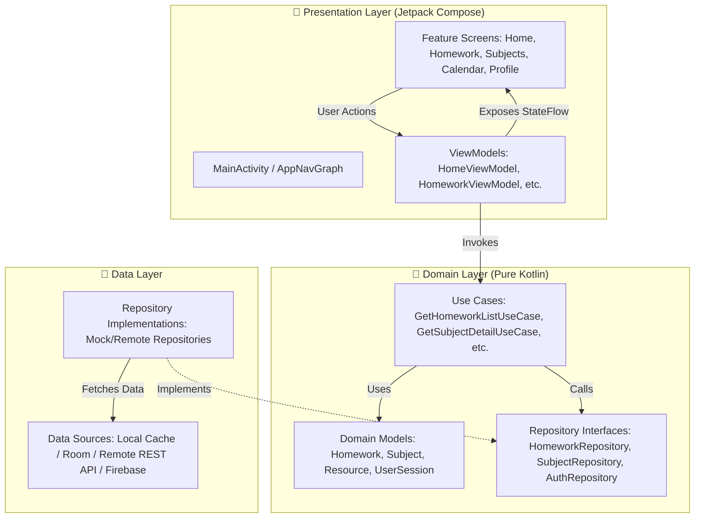

<div align="center">

# 🎓 MyTuition

### *A Minimal, Calm, and Lightning-Fast Education Companion for Students & Parents*

[](https://kotlinlang.org)
[](https://developer.android.com)
[](https://developer.android.com/jetpack/compose)
[](https://m3.material.io)
[](https://developer.android.com/topic/architecture)
[](LICENSE)

<br/>

> **MyTuition** is a modern student- and parent-facing Android application crafted for coaching institutes, tuition centers, and independent educators. Built on the philosophy of **calm design, lightning-fast native performance, and effortless usability**, it strips away the bloat of traditional academic ERPs and focuses purely on what matters: **today's classes, pending tasks, study resources, and academic progress.**

---

</div>

## 🌟 Product Philosophy

Most education ERP software is cluttered, slow, and overwhelming. **MyTuition** reimagines the student experience from the ground up:

* 🧘‍♂️ **Calm & Distraction-Free**: Generous whitespace, purposeful typography, and a curated color palette ensure zero cognitive overload.
* ⚡ **Lightning-Fast Native Compose**: Built 100% with declarative Jetpack Compose, state-driven reactivity via Kotlin `StateFlow`, and buttery-smooth 60/120 FPS animations.
* 🎨 **Neo-Brutalist Claymorphic Design**: Tactile rounded surfaces, subtle shadows, organic rotations, and high-contrast accents (Warm Ivory, Premium Lime `#D4FF26`, Electric Purple `#7B52FF`, Soft Coral, Sky Blue).
* 🛡️ **Clean Architecture**: Domain-driven, testable, and loosely coupled. Swapping mock data with a real REST/GraphQL or Firebase backend takes minutes.

---

## 📸 Key Features & Screen Catalog

### 1. 🚀 Splash & Fluid Mascot Login
* **Playful Interactive Mascot**: Animated character with eye-tracking and personality that greets students on launch.
* **Frictionless Onboarding**: One-tap demo login, student phone/OTP authentication, Google Sign-In, and GitHub authentication.
* **Role Recognition**: Automatically adapts dashboard views for **Students** and **Parents**.

### 2. 🏠 Intelligent Home Dashboard
* **Hero "YOUR DAY" Card**: Instant glance at the next upcoming class, lecture timing, room location, and live status.
* **Interactive Subjects Carousel**: Custom hand-drawn canvas icons (Math, Physics, Chemistry, English) with spring physics and tactile tap effects that jump directly into subject details.
* **"Things to Finish" Widget**: Live circular progress ring tracking pending assignments and quick-navigation to deadlines.
* **Quiet Info Stream**: Non-intrusive fee payment status (`₹2,500 due on 10 Sep`) and institute announcements.

### 3. 📝 Homework Command Center
* **Dynamic Filter Tabs**: Filter assignments by **All**, **Pending**, **Completed**, and **Overdue**.
* **Status Badges**: Distinct visual pills with real-time countdowns (`Due in 2 days`, `Overdue`).
* **Deep Homework Details**: Complete assignment guidelines, teacher instructions, and one-tap download for attached study materials & PDFs.
* **Instant Completion Toggle**: Seamlessly mark assignments as completed with immediate state updates.

### 4. 📚 Subjects & Resources Directory
* **Staggered Subject Grid**: Beautiful claymorphic cards displaying teacher names, pending task counters, and available learning resources.
* **Subject Detail Hub**: Dedicated view for each subject containing historical homework, chapter notes, and question banks.

### 5. 📅 Dynamic Timetable & Calendar
* **Horizontal Week Selector**: Fluid day-by-day strip (`Mon 8` through `Sun 14`) with reactive selection states and spring animations.
* **Session Cards**: Color-coded cards for scheduled lectures, lab exams, doubt-clearing sessions, and Parent-Teacher Meetings (PTMs).

### 6. 👤 Student Profile & Settings
* **Student Identity Card**: Mohit Raj · Class 10-A with custom avatar badge.
* **Settings & Preferences**: Push notifications, language preferences, support contact, and privacy controls.
* **One-Tap Logout**: Secure session teardown returning to the login flow.

---

## 🏗️ Architecture & Blueprint

MyTuition strictly follows **Clean Architecture** combined with the **Unidirectional Data Flow (UDF)** pattern:



### Unidirectional Data Flow (UDF)
1. **User Action / Event**: User taps a filter, clicks a subject, or marks homework done.
2. **ViewModel Handling**: ViewModel receives event, launches coroutine in `viewModelScope`, and triggers Domain Use Cases.
3. **Repository Execution**: Use case executes business logic against repository.
4. **StateFlow Emission**: `UiState` emits `Loading`, `Success(data)`, or `Error(message)`.
5. **Declarative Recomposition**: Compose UI passively observes `uiState.collectAsState()` and renders pixel-perfect screens.

---

## 🛠️ Technology Stack

| Component | Technology | Description |
| :--- | :--- | :--- |
| **Language** | Kotlin 2.0+ | Modern, safe, and expressive language for Android |
| **UI Framework** | Jetpack Compose | Modern declarative UI toolkit |
| **Design System** | Material 3 + Custom Tokens | Custom palette (`WarmIvory`, `PremiumLime`, `PremiumPurple`, `PremiumCoral`) |
| **Architecture** | Clean Architecture + MVVM | Scalable presentation, domain, and data separation |
| **Async & Concurrency** | Kotlin Coroutines & StateFlow | Reactive, thread-safe asynchronous data streaming |
| **Navigation** | Navigation Compose | Type-safe in-app routing via `AppNavGraph` and `Routes` |
| **Dependency Injection** | AppContainer Pattern | Lightweight service locator and constructor injection |
| **Image Loading** | Coil Compose | Asynchronous image loading with caching |
| **Testing** | JUnit 4, Coroutines Test, Roborazzi | Unit testing, ViewModel tests, and snapshot testing |

---

## 📂 Project Directory Structure

```text
MyTuition/
├── app/
│   ├── src/
│   │   ├── main/
│   │   │   ├── AndroidManifest.xml
│   │   │   ├── java/com/example/mytuition/
│   │   │   │   ├── MainActivity.kt               # Single Activity host with edge-to-edge
│   │   │   │   ├── MyTuitionApp.kt               # Application entry point
│   │   │   │   ├── core/
│   │   │   │   │   ├── data/repository/          # Mock and network repository implementations
│   │   │   │   │   ├── designsystem/             # Color tokens, Typography, Shapes, Theme
│   │   │   │   │   ├── di/                       # AppContainer dependency container
│   │   │   │   │   ├── domain/
│   │   │   │   │   │   ├── model/                # Homework, Subject, Resource, UserSession
│   │   │   │   │   │   ├── repository/           # AuthRepository, HomeworkRepository, SubjectRepository
│   │   │   │   │   │   └── usecase/              # Business use cases
│   │   │   │   │   └── navigation/               # Routes.kt and AppNavGraph.kt
│   │   │   │   └── feature/
│   │   │   │       ├── auth/                     # LoginScreen & interactive mascot
│   │   │   │       ├── calendar/                 # CalendarScreen with interactive week picker
│   │   │   │       ├── home/                     # MainScreen, HomeScreen, HomeViewModel, FloatingNav
│   │   │   │       ├── homework/                 # HomeworkScreen, HomeworkDetailScreen, HomeworkViewModel
│   │   │   │       ├── profile/                  # ProfileScreen with settings & logout
│   │   │   │       ├── splash/                   # SplashScreen with branded animation
│   │   │   │       └── subjects/                 # SubjectsScreen, SubjectDetailScreen, SubjectsViewModel
│   │   │   └── res/                              # Drawables, strings, mipmaps, and XML configs
│   │   └── test/                                 # Unit & ViewModel tests (Subject, Homework, Auth)
│   ├── build.gradle.kts                          # App build configuration & dependencies
│   └── proguard-rules.pro                        # R8/Proguard optimization rules
├── gradle/                                       # Gradle wrapper and version catalogs (libs.versions.toml)
├── .gitignore                                    # Production-grade gitignore for Android
├── build.gradle.kts                              # Root project configuration
├── settings.gradle.kts                           # Module and plugin management
└── README.md                                     # Project documentation
```

---

## 🚀 Getting Started

### Prerequisites
* **Android Studio**: Android Studio Koala / Ladybug (2024.1+) or newer
* **JDK**: OpenJDK 17 or JDK 21
* **Android SDK**: Min SDK 24 (Android 7.0) · Target SDK 36 (Android 15)
* **Gradle**: Gradle 8.7+ (configured via Gradle Wrapper)

### Installation & Run

1. **Clone the repository**:
   ```bash
   git clone https://github.com/mohitraj8503/MyTuition.git
   cd MyTuition
   ```

2. **Open in Android Studio**:
   - Open Android Studio.
   - Select **File > Open...** and choose the `MyTuition` project root.
   - Allow Gradle Sync to finish automatically.

3. **Run on an Emulator or Physical Device**:
   - Select an Android Virtual Device (AVD with API 24+) or connect an Android phone with USB Debugging enabled.
   - Press **Run ▶ (Shift + F10)** or build via CLI:
     ```bash
     ./gradlew assembleDebug
     ```

4. **Install Debug APK directly via ADB**:
   ```bash
   adb install -r app/build/outputs/apk/debug/app-debug.apk
   ```

---

## 🧪 Testing Suite

MyTuition includes comprehensive unit tests for business logic, repositories, and ViewModels:

```bash
# Run all local JVM unit tests
./gradlew testDebugUnitTest

# Run Roborazzi Compose screenshot verification (if configured)
./gradlew verifyRoborazziDebug
```

### Covered Test Cases:
* ✅ `HomeworkViewModelTest`: State emissions, filter transformations, and status filtering.
* ✅ `HomeworkDetailViewModelTest`: Attachment loading and marking homework completed.
* ✅ `SubjectsViewModelTest`: Subject listing and task counts.
* ✅ `SubjectDetailViewModelTest`: Resource retrieval and recent assignment aggregation.

---

## 🎨 Design System Guide

MyTuition uses a proprietary design language tailored for students:

```kotlin
// Core Brand Colors
val WarmIvory       = Color(0xFFFBF9F6)   // Main screen background, eliminates eye fatigue
val PremiumPurple   = Color(0xFF7B52FF)   // Primary accent, brand identity, and hero banner
val PremiumLime     = Color(0xFFD4FF26)   // Active highlights, badges, and progress meters
val PremiumCoral    = Color(0xFFFF8080)   // Urgent deadlines, alerts, and overdue items
val PremiumBlue     = Color(0xFF90D0FF)   // Resource materials and science cards
val PremiumLavender = Color(0xFFD2B0FF)   // Secondary subject tags and accents
val DeepNavyText    = Color(0xFF13131A)   // Ultra-high contrast readable typography
```

---

## 🗺️ Roadmap & Upcoming Integrations

- [ ] **Real-time WhatsApp Notification Bridge**: Direct alerts to parents when homework is assigned or overdue.
- [ ] **Offline-First SQLite/Room Caching**: Full offline access to notes and worksheets with background sync.
- [ ] **In-App PDF Reader**: Native document viewer without requiring third-party PDF apps.
- [ ] **UPI & Razorpay Fee Gateway**: Instant, one-tap tuition fee settlement with digital receipts.
- [ ] **Voice Homework Reader**: Audio playback of instructions for younger students.

---

## 🤝 Contributing

Contributions are what make the open-source community an incredible place to learn, inspire, and create. Any contributions you make are **greatly appreciated**!

1. Fork the Project
2. Create your Feature Branch (`git checkout -b feature/AmazingFeature`)
3. Commit your Changes (`git commit -m 'Add some AmazingFeature'`)
4. Push to the Branch (`git push origin feature/AmazingFeature`)
5. Open a Pull Request

---

## 📄 License

Distributed under the **MIT License**. See `LICENSE` for more information.

---

## 👨‍💻 Author & Maintainer

**Mohit Raj**
* GitHub: [@mohitraj8503](https://github.com/mohitraj8503)
* Repository: [https://github.com/mohitraj8503/MyTuition](https://github.com/mohitraj8503/MyTuition)

<div align="center">
  <sub>Made with ❤️ for students, teachers, and parents everywhere.</sub>
</div>
